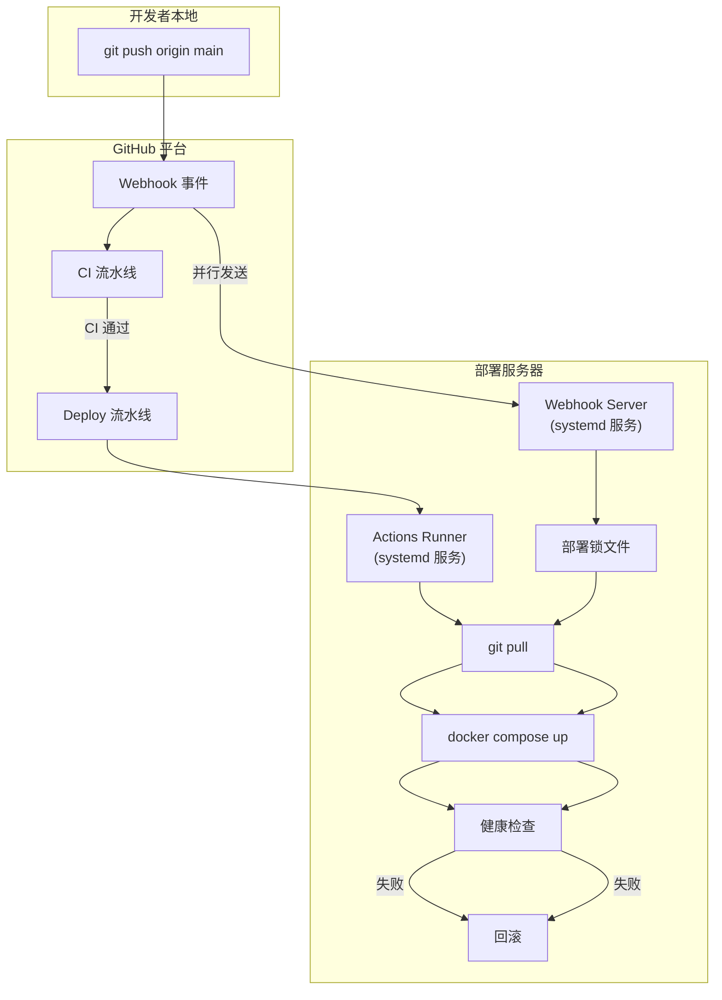

## Product Overview

实现 Git 推送新版本后服务器自动同步更新部署，采用双通道方案：GitHub Actions self-hosted Runner 为主通道，Webhook 接收为备用/轻量通道。

## Core Features

- **GitHub Actions 自动部署（主通道）**：push 到 main 分支自动触发 CI 通过后执行部署，包含健康检查和回滚机制
- **Self-hosted Runner 安装配置**：独立脚本一键安装 GitHub Actions Runner，注册为 systemd 服务，支持从 bootstrap 脚本集成调用
- **Webhook 自动部署（备用通道）**：服务器端轻量 HTTP 服务接收 GitHub Webhook，验证 HMAC 签名后自动 git pull + docker compose 重建部署
- **部署安全**：Webhook 签名验证、部署并发锁、健康检查、失败回滚

## Tech Stack

- **主通道**: GitHub Actions + self-hosted runner + systemd
- **备用通道**: Python3 (http.server, hmac, subprocess) + systemd — Ubuntu 22.04+ 预装 Python3，零外部依赖
- **部署编排**: docker compose（与现有架构一致）

## Implementation Approach

### 方案整体架构



### 一、GitHub Actions Runner 方案（主通道）

**工作原理**: push 到 main → CI 流水线（前端构建+后端测试+Docker 镜像构建验证）→ 通过后触发 Deploy 流水线 → self-hosted runner 执行 `actions/checkout` + `docker compose up -d --build`

**增强 deploy.yml**:

- 添加 CI 依赖门控：使用 `needs` + `if: github.event_name == 'push'` 确保只在 CI 通过后部署，`workflow_dispatch` 手动触发时跳过 CI 门控
- 添加部署后健康检查：复用 bootstrap 脚本中的 `check_service_health` 逻辑，curl 轮询应用接口，超时则回滚
- 添加回滚机制：部署前标记当前容器 `docker tag ytbx-app:latest ytbx-app:rollback`，失败时 `docker compose up -d` 回退到 rollback 镜像
- 添加部署日志和清理：`docker image prune -f` 清理旧镜像，输出部署耗时

**Runner 安装脚本 `deploy/setup-runner.sh`**:

- 从 `https://github.com/actions/runner/releases/latest` 下载 runner
- 使用 GitHub PAT 或注册 token 配置（从环境变量或交互输入获取）
- 注册为 systemd 服务 `actions.runner.ytbx.service`
- 支持参数：`--token TOKEN --repo OWNER/REPO --user RUNNER_USER`

**集成到 bootstrap 脚本**:

- 在 `server-bootstrap-ubuntu.sh` 的 `main()` 函数中，在服务启动成功后新增可选步骤
- 添加 `ENABLE_RUNNER` 配置变量（默认 0），交互提示是否配置 Actions Runner
- 调用 `deploy/setup-runner.sh` 完成安装

### 二、Webhook 方案（备用通道）

**工作原理**: GitHub push 事件 → 发送 POST 到服务器 `/webhook` 端点 → Python HTTP 服务接收 → HMAC-SHA256 签名验证 → `flock` 文件锁防并发 → `git pull` → `docker compose up -d --build` → 健康检查 → 返回结果

**Webhook Server (`deploy/webhook/webhook-server.py`)**:

- 使用 Python3 标准库 `http.server`、`hmac`、`hashlib`、`subprocess`、`json`
- 监听端口默认 `9000`，通过 `WEBHOOK_PORT` 环境变量配置
- `WEBHOOK_SECRET` 环境变量存储 GitHub Webhook Secret
- 请求处理流程：

1. 验证 `X-GitHub-Event` 为 `push`
2. 验证 `X-Hub-Signature-256` HMAC 签名
3. 检查推送分支是否为 `main`
4. `flock -n deploy/.deploy.lock` 获取排他锁，防止并发部署
5. 子进程调用 `deploy/webhook/webhook-deploy.sh` 执行实际部署
6. 返回 HTTP 200/500 状态码

**部署执行脚本 (`deploy/webhook/webhook-deploy.sh`)**:

- 接收参数：项目路径、提交 SHA、推送者
- 记录部署日志到 `deploy/deploy-webhook-YYYYMMDD_HHMMSS.log`
- `git pull origin main`
- `docker compose --env-file deploy/.env -f deploy/docker-compose.yml up -d --build --remove-orphans`
- 健康检查（curl 轮询，最多 30 次，间隔 2 秒）
- 失败时回滚到上一版本容器

**Webhook 服务安装 (`deploy/webhook/setup-webhook.sh`)**:

- 生成 systemd service unit `ytbx-webhook.service`
- 生成 systemd environment file `/etc/ytbx-webhook/env`（存储 WEBHOOK_SECRET 和 WEBHOOK_PORT）
- 支持参数：`--secret SECRET --port PORT`
- 启用并启动服务

### 三、CI 门控与并发控制

- CI 流水线（已有）负责构建和测试验证
- deploy.yml 通过 `needs: [build-test]` + `if: success()` 确保仅在 CI 通过后部署
- `concurrency: group: ytbx-production` 已有并发控制，防止同时部署
- Webhook 方案使用 `flock` 文件锁实现进程级并发控制

## Implementation Notes

- **安全**: Webhook Secret 通过 systemd environment file 存储（权限 600），GitHub PAT 不落盘
- **回滚**: 两个方案共享同一回滚策略：部署前 tag 当前镜像为 `rollback`，失败时重启 rollback 镜像
- **日志**: 所有部署操作记录到 `deploy/deploy-*.log`，便于排查问题
- **兼容性**: 不修改现有 docker-compose.yml 和 Dockerfile，两个新方案完全基于现有编排结构
- **Runner 安装需要交互**: PAT Token 或 Runner Registration Token 必须由用户手动提供，脚本不自动获取

## Directory Structure

```
/home/ubuntu/YouXuanTong/
├── .github/workflows/
│   ├── ci.yml                          # [MODIFY] CI 流水线，添加 deploy job 依赖标识
│   └── deploy.yml                      # [MODIFY] 增强部署：CI 门控、健康检查、回滚机制、部署日志
├── deploy/
│   ├── server-bootstrap-ubuntu.sh      # [MODIFY] 在 main() 中添加可选的 Runner 安装和 Webhook 配置步骤
│   ├── setup-runner.sh                 # [NEW] GitHub Actions self-hosted Runner 安装/配置脚本
│   ├── webhook/
│   │   ├── webhook-server.py           # [NEW] Webhook HTTP 接收服务（Python3 标准库）
│   │   ├── webhook-deploy.sh           # [NEW] Webhook 触发的部署执行脚本（git pull + docker compose + 健康检查 + 回滚）
│   │   ├── setup-webhook.sh            # [NEW] Webhook 服务安装/配置脚本（生成 systemd unit + environment file）
│   │   └── .env.example                # [NEW] Webhook 配置模板（WEBHOOK_SECRET, WEBHOOK_PORT）
│   ├── docker-compose.yml              # [KEEP] 不修改
│   └── .env.example                    # [MODIFY] 添加 ENABLE_RUNNER 和 ENABLE_WEBHOOK 配置项
└── docs/
    └── auto-deploy.md                  # [NEW] 自动部署配置指南文档
```

## Agent Extensions

### SubAgent

- **code-explorer**
- Purpose: 在实现过程中搜索现有代码模式和引用，确保新脚本与现有 bootstrap 脚本风格一致
- Expected outcome: 确认日志函数、验证函数、错误处理模式等的复用方式，保持代码风格统一